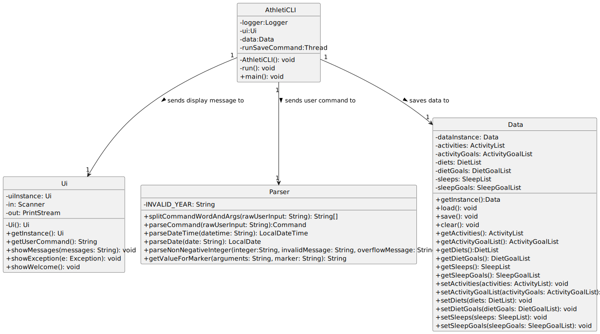

- Table of Contents
{:toc}

## Acknowledgements

{list here sources of all reused/adapted ideas, code, documentation, and third-party libraries -- include links to the original source as well}

## Design

This section provides a high-level explanation of the design and implementation of AthletiCLI, 
supported by UML diagrams and short code snippets to illustrate the flow of data and interactions between the 
components.

### Architecture

Given below is a quick overview of main components and how they interact with each other.

**Main components of the architecture**

**`AthletiCLI`** is in charge of the app launch and shut down.

The bulk of the AthletiCLI’s work is done by the following components, with each of them corresponds to a package:

* [`UI`](https://github.com/AY2324S1-CS2113-T17-1/tp/tree/master/src/main/java/athleticli/ui): The UI and other UI-related sub-components (e.g., `Parser`) of AthletiCLI.
* [`Storage`](https://github.com/AY2324S1-CS2113-T17-1/tp/tree/master/src/main/java/athleticli/storage): Reads data from, and writes data to, the hard disk.
* [`Data`](https://github.com/AY2324S1-CS2113-T17-1/tp/tree/master/src/main/java/athleticli/data): Holds the data of AthletiCLI in memory.
* [`Commands`](https://github.com/AY2324S1-CS2113-T17-1/tp/tree/master/src/main/java/athleticli/commands): The command executors.

[`Exceptions`](https://github.com/AY2324S1-CS2113-T17-1/tp/tree/master/src/main/java/athleticli/exceptions) represents exceptions used by multiple other components.

### Overview

The class diagram shows the relationship between `AthletiCLI`, `Ui`, `Parser`, and `Data`.

  

### Data Component

The class diagram shows how the `Data` component is constructed with multiple classes.

  

**How the architecture components interact with each other**

The _Sequence Diagram_ below shows how the components interact with each other for the scenario where the user issues the command `help add-diet`.

This diagram involves the interaction between `AthletiCLI`, `UI` (including the parser), `Commands` components and the user.

The `Storage` component only interacts with the `Data` component. The _Sequence Diagram_ below shows how they interact with each other for the scenario where a `save` command is executed.

For simplicity, only 1 `StorableList` is drawn instead of the actual 6.

## Implementation

### Diet Management in AthletiCLI

#### [Implemented] Setting Up, Editing, Deleting, Listing, and Finding Diets

Regardless of the operation you are performing on diets (setting up, editing, deleting, listing, or finding), the process follows a general five-step pattern in AthletiCLI:

1. **Input Processing**: The user's input is passed through AthletiCLI to the Parser Class. Examples of user inputs include:
    - `add-diet calories/500 protein/20 carb/50 fat/10 datetime/2021-09-01 06:00` for adding a diet.
    - `edit-diet 1 calories/500 protein/20 carb/50 fat/10 datetime/2021-09-01 06:00` for editing a diet.
    - `delete-diet 1` for deleting a diet.
    - `list-diet` for listing all diets.
    - `find-diet 2021-09-01` for finding diets of a particular date.

2. **Command Identification**: The Parser Class identifies the type of diet operation and passes the necessary parameters.

3. **Command Creation**: An instance of the corresponding command class is created (e.g., AddDietCommand, EditDietCommand, etc.) and returned to AthletiCLI.

4. **Command Execution**: AthletiCLI executes the command, interacting with the data instance of DietList to perform the required operation.

5. **Result Display**: A message is returned post-execution and passed through AthletiCLI to the UI for display to the user.

By following these general steps, AthletiCLI ensures a streamlined process for managing diet-related tasks.

#### [Implemented] Setting Up of Diet Goals

This following sequence diagram show how the 'set-diet-goal' command works:

  

**Step 1:** The input from the user ("set-diet-goal fats/1") runs through AthletiCLI to the Parser Class.

**Step 2:** The Parser Class will identify the request as setting up a diet goal and pass in the parameters
"fats/1".

**Step 3:** A temporary dietGoalList is created to store newly created diet goals.

**Step 4:** The inputs are verified against our lists of approved diet goals.

**Step 5:** For each of the diet goals that are valid, a dietGoal object will be created and stored in the 
temporary dietGoalList.

**Step 6:** The Parser then creates for an instance of SetDietGoalCommand and returns the instance to 
AthletiCLI.

**Step 7:** AthletiCLI will execute the SetDietGoalCommand. This adds the dietGoals that are present in the 
temporary list into the data instance of DietGoalList which will be kept for records.

**Step 8:** After executing the SetDietGoalCommand, SetDietGoalCommand returns a message that is passed to 
AthletiCLI to be passed to UI(not shown) for display.

#### [Proposed] Implementation of DietGoalList

The current implementation of DietGoalList is an ArrayList.
It helps to store dietGoals, however it is not efficient in searching for a particular dietGoal.
At any instance of time, there could only be the existence of one dietGoal.
Verifying if there is an existence of a dietGoal using an ArrayList takes O(n) time, where n is the number of dietGoals.
The proposed change will be to change the underlying data structure to a hashmap for amortised O(1) time complexity
for checking the presence of a dietGoal.

#### [Implemented] Adding activities
The `add-activity` feature allows users to add a new activity into the application.
These are the main components behind the architecture of the `add-activity` feature:
1. `AthletiCLI`: faciliates the mechanism. It captures the input and calls the parser and execution.
2. `Parser`: parses the user input and generates the appropriate command object and activity 
   instance.
3. `AddActivityCommand`: encapsulates the execution of the `add-activity` command. It adds 
   the activity to the data.
4. `Activity`: represents the activity that is to be added.
5. `Data`: holds current state of the activity list.
6. `ActivityList`: maintains the list of all added activities.

Here is a class diagram of the relationships between the data components `Activity`,`Data` and `ActivityList`:
(tbd)

Given below is an example usage scenario and how the add mechanism behaves at each step.

**Step 1 - Input Capture:** The user issues an `add-activity ...` which is captured and passed to the Parser by the 
running AthletiCLI instance.

**Step 2 - Activity Parsing:** The Parser parses the raw input to obtain the arguments of the activity. Given that all 
parameters are provided correctly and no exception is thrown, a new activity object is created.

**Step 3 - Command Parsing:** In addition the parser will create an `AddActivityCommand` object with the newly added 
activity attached to it. The command implements the `AddActivityCommand#execute()` operation and is passed to 
the AthletiCLI instance.

**Step 4 - Activity Addition:** The AthletiCLI instance executes the `AddActivityCommand` object. The command will 
access the data and retrieve the currently stored list of activities stored inside it. The new `Activity` object is 
added to the list.

**Step 5 - User Interaction:** Once the activity is successfully added, a confirmation message is displayed to the user.

The following sequence diagram shows how the `add-activity` operation works:

  

#### [Implemented] Tracking activity goals

With the `set-activity-goal` feature, users can set periodic goals for their activities.
The fulfillment of these goals is tracked automatically and can be evaluated by the user at any time.

These are the key components and their roles in the architecture of the goal tracking:
* `SetActivityGoalCommand`: encapsulates the execution of the `set-activity-goal` command. It adds 
  the activity goal to the data.
* `ActivityGoal`: represents the activity goal that is to be added and contains functionality to 
  track the fulfillment of the goal. 
* `ActivityList`: contains key functionality to retrieve and filter the activity list according to the specified 
  properties of the goal.

Given below is an example usage scenario and how the goal setting and tracking mechanism behaves at 
each step.

1. **Step 1 - Input Capture:** The user issues a `set-activity-goal ...` which is captured and passed to the 
   Parser by the running AthletiCLI instance.
2. **Step 2 - Goal Parsing:** The Parser parses the raw input to obtain the sports, target and timespan of the goal. 
   Given that all these parameters are provided correctly and no exception is thrown, a new activity goal object is 
   created.
3. **Step 3 - Command Parsing:** In addition the parser will create a `SetActivityGoalCommand` object with the newly 
   added activity goal attached to it. The command implements the `SetActivityGoalCommand#execute()` operation and is 
   passed to the AthletiCLI instance.
4. **Step 4 - Goal Addition:** The AthletiCLI instance executes the `SetActivityGoalCommand` object. The command will 
   access the data and retrieve the currently stored list of activity goals stored inside it. The new `ActivityGoal` 
   object is added to the list.

The following sequence diagram shows how the `set-activity-goal` operation works:

  

Assume that the user has set a goal to run 10km per week and has already tracked two running activities of 5km each.
The following describes how the goal evaluation works after being invoked by the user, e.g., with a list-activity-goal command:

5. **Step 5 - Goal Evaluation:** The evaluation of the goal is operated by the `ActivityGoal` object. It retrieves the 
activity list with the two tracked activities from the data and calls the total distance calculation function. It filters the 
   activity list according to the specified timespan and sports of the goal. The current value obtained by this, 
   10km in the example, is returned to the `ActivityGoal` object, which then compares it to the target value of the goal. This mechanism is visualized in the following sequence diagram:

    

### Sleep Management in AthletiCLI

#### [Implemented] Finding, Adding, Editing, Deleting, Listing Sleep

1. **Input Processing**: The user's input is passed through AthletiCLI to the Parser Class. Examples of user inputs include:
    - "add-sleep hours/8 datetime/2021-09-01 06:00" for adding sleep.
    - "edit-sleep 1 hours/8 datetime/2021-09-01 06:00" for editing sleep.
    - "delete-sleep 1" for deleting sleep.
    - "list-sleep" for listing all sleep.

2. **Command Identification**: The Parser Class identifies the type of sleep operation and passes the necessary parameters.

3. **Command Creation**: An instance of the corresponding command class is created (e.g., AddSleepCommand, EditSleepCommand, etc.) and returned to AthletiCLI.

4. **Command Execution**: AthletiCLI executes the command, interacting with the data instance of SleepList to perform the required operation.

5. **Result Display**: A message is returned post-execution and passed through AthletiCLI to the UI for display to the user.

The following class diagram shows how sleep and sleep-related classes are constructed in AthletiCLI:

  

## Product scope
### Target user profile

AthletiCLI is designed for athletic individuals who are committed to optimizing their performance. 

These users are highly disciplined and engaged not only in regular, intense physical training but also in nutrition, mental conditioning, and recovery. 

They are looking for a holistic tool that integrates all facets of an athletic lifestyle. AthletiCLI serves as a daily or weekly companion, designed to monitor, track, and analyze various elements crucial for high-level athletic performance. 

### Value proposition

AthletiCLI provides a streamlined, integrated solution for athletic individuals focused on achieving peak performance. 

While the app includes robust capabilities for tracking physical training metrics, it also offers features for monitoring dietary habits and sleep metrics. 

By providing a comprehensive view of various performance-related factors over time, AthletiCLI enables athletes to identify trends, refine their training and lifestyle habits, and optimize outcomes. The app is more than a tracking tool—it's a performance optimization platform that takes into account the full spectrum of an athlete's life. 

## User Stories

| Version | As a ...                        | I want to ...                                                     | So that I can ...                                                                      |
|---------|---------------------------------|-------------------------------------------------------------------|----------------------------------------------------------------------------------------|
| v1.0    | fitness enthusiastic user       | add different activities including running, swimming and cycling) | keep track of my fitness activities and athletic performance.                          |
| v1.0    | analytical user                 | view my activity details at any point in time                     | track my progress and make informed decisions about my fitness routine.                |
| v1.0    | clumsy user                     | delete any tracked activity                                       | I can correct any mistakes or remove accidentally added activities.                    |
| v1.0    | detail-oriented user            | modify any of my tracked activities                               | ensure accuracy in my fitness records.                                                 |
| v1.0    | health-conscious user           | add my dietary information                                        | keep track of my daily calorie and nutrient intake                                     |
| v1.0    | organized user                  | delete a dietary entry                                            | remove outdated or incorrect data from my diet records                                 |
| v1.0    | fitness enthusiast              | view all my diet records                                          | have a clear overview of my dietary habits and make informed decisions on my diet      |
| v1.0    | new user                        | see usage instructions                                            | refer to them when I forget how to use the application                                 |
| v1.0    | motivated weight-conscious user | set diet goals                                                    | have the motivation to work towards keeping weight in check.                           |
| v1.0    | forgetful user                  | see all my diet goals                                             | remind myself of all the diet goals I have set.                                        |
| v1.0    | regretful user                  | remove my diet goals                                              | I can rescind the strict goals I set previously when I find the goals too far fetched. |
| v1.0    | motivated user                  | update my diet goals                                              | I can work towards better version of myself by setting stricter goals.                 |
| v1.0    | sleep deprived user             | add my sleep information                                          | keep track of my sleep habits and identify areas for improvement                       |
| v1.0    | sleep deprived user             | delete a sleep entry                                              | remove outdated or incorrect data from my sleep records                                |
| v1.0    | sleep deprived user             | view all my sleep records                                         | have a clear overview of my sleep habits and make informed decisions on my sleep       |
| v1.0    | sleep deprived user             | edit my sleep entries                                             | correct any mistakes or update my sleep information as needed                          |
| v2.0    | user                            | find a to-do item by name                                         | locate a to-do without having to go through the entire list                            |
| v2.0    | meticulous user                 | edit my dietary entries                                           | correct any mistakes or update my diet information as needed                           |
| v2.0    | active user                     | set activity goals                                                | work towards a specific fitness target for different sports activities.                |
| v2.0    | adaptable athlete               | edit my activity goals                                            | modify my fitness targets to align with my current fitness level and schedule.         |
| v2.0    | organized athlete               | list all my activity goals                                        | have a clear overview of my set targets and track my progress easily.                  |
| v2.0    | meticulous user                 | find my diets by date                                             | easily retrieve my dietary records for a specific day and monitor my eating habits.    |
| v2.0    | motivated user                  | keep track of my diet goals for a period of time | I can monitor my diet progress on a weekly basis and make adjustments if needed.       |                                         |

## Non-Functional Requirements

1. AthletiCLI should work on Windows, MacOS and Linux that has java 11 installed.
2. AthletiCLI should be able to store data locally.
3. AthletiCLI should be able to work offline.
4. AthletiCLI should be easy to use.

## Glossary

* *glossary item* - Definition

## Instructions for manual testing

{Give instructions on how to do a manual product testing e.g., how to load sample data to be used for testing}
