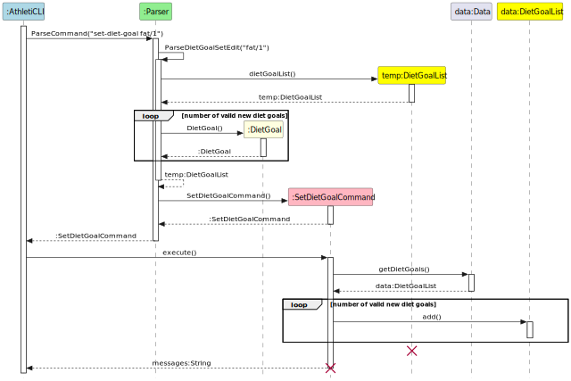

# Developer Guide

## Content Page
- [Acknowledgements](#acknowledgements)
- [Design](#design-and-implementation)
- [Product Scope](#product-scope)
- [Target User Profile](#target-user-profile)
- [Value Proposition](#value-proposition)
- [User Stories](#user-stories)
- [Non-functional Requirements](#non-functional-requirements)
- [Glossary](#glossary)
- [Instruction for Manual Testing](#instructions-for-manual-testing)

## Acknowledgements

{list here sources of all reused/adapted ideas, code, documentation, and third-party libraries -- include links to the original source as well}

## Design & implementation

This section provides a high-level explanation of the design and implementation of key AthletiCLI functionalities, 
supported by diagrams and code snippets to illustrate the flow of data and interactions between the components.

{Describe the design and implementation of the product. Use UML diagrams and short code snippets where applicable.}
#### [Implemented] Setting Up of Diet Goals

This following sequence diagram show how the 'set-diet-goal' command works:

  

Step 1. The input from the user ("set-diet-goal fats/1") runs through AthletiCLI to the Parser Class.

Step 2. The Parser Class will identify the request as setting up a diet goal and pass in the parameters
"fats/1".

Step 3. A temporary dietGoalList is created to store newly created diet goals.

Step 4. The inputs are verified against our lists of approved diet goals.

Step 5. For each of the diet goals that are valid, a dietGoal object will be created and stored in the 
temporary dietGoalList.

Step 6. The Parser then creates for an instance of SetDietGoalCommand and returns the instance to 
AthletiCLI.

Step 7. AthletiCLI will execute the SetDietGoalCommand. This adds the dietGoals that are present in the 
temporary list into the data instance of DietGoalList which will be kept for records.

Step 8. After executing the SetDietGoalCommand, SetDietGoalCommand returns a message that is passed to 
AthletiCLI to passed to UI(not shown) for display.

#### [Implemented] Adding activities
The `add-activity` feature allows users to add a new activity into the application.
These are the main components behind the architecture of the `add-activity` feature:
1. `AthletiCLI`: faciliates the mechanism. It captures the input and calls the parser and execution.
2. `Parser`: parses the user input and generates the appropriate command object and activity 
   instance.
3. `AddActivityCommand`: encapsulates the execution of the `add-activity` command. It adds 
   the activity to the data.
4. `Activity`: represents the activity that is to be added.
5. `Data`: holds current state of the activity list.
6. `ActivityList`: maintains the list of all added activities.

Given below is an example usage scenario and how the add mechanism behaves at each step.

**Step 1 - Input Capture:** The user issues an `add-activity ...` which is captured and passed to the Parser by the 
running AthletiCLI instance.

**Step 2 - Activity Parsing:** The Parser parses the raw input to obtain the arguments of the activity. Given that all 
parameters are provided correctly and no exception is thrown, a new activity object is created.

parameter values and creates an `AddActivityCommand object with the newly added activity object attached to it.

**Step 3 - Command Parsing:** In addition the parser will create an `AddActivityCommand` object with the newly added 
activity attached to it. The command implements the `AddActivityCommand#execute()` operation and is passed to 
the AthletiCLI instance.

**Step 4 - Activity Addition:** The AthletiCLI instance executes the `AddActivityCommand` object. The command will 
access the data 
and retrieve the currently stored list of activities stored inside it. The new `Activity` object is added to the 
list.

**Step 5 - User Interaction:** Once the activity is successfully added, a confirmation message is displayed to the user.

The following sequence diagram shows how the `add-activity` operation works:

  

#### [Proposed] Implementation of DietGoalList

The current implementation of DietGoalList is an ArrayList.
It helps to store dietGoals, however it is not efficient in searching for a particular dietGoal.
At any instance of time, there could only be the existence of one dietGoal.
Verifying if there is an existence of a dietGoal using an ArrayList takes O(n) time, where n is the number of dietGoals.
The proposed change will be to change the underlying data structure to a hashmap for amortised O(1) time complexity
for checking the presence of a dietGoal. 

## Product scope
### Target user profile

{Describe the target user profile}

### Value proposition

{Describe the value proposition: what problem does it solve?}

## User Stories

| Version | As a ...                        | I want to ...             | So that I can ...                                                                      |
|---------|---------------------------------|---------------------------|----------------------------------------------------------------------------------------|
| v1.0    | new user                        | see usage instructions    | refer to them when I forget how to use the application                                 |
| v1.0    | motivated weight-conscious user | set diet goals            | have the motivation to work towards keeping weight in check.                           |
| v1.0    | forgetful user                  | see all my diet goals     | remind myself of all the diet goals I have set.                                        |
| v1.0    | regretful user                  | remove my diet goals      | I can rescind the strict goals I set previously when I find the goals too far fetched. |
| v1.0    | motivated user                  | update my diet goals      | I can work towards better version of myself by setting stricter goals.                 |
| v2.0    | user                            | find a to-do item by name | locate a to-do without having to go through the entire list                            |

## Non-Functional Requirements

{Give non-functional requirements}
1. AthletiCLI should work on Windows, MacOS and Linux that has java 11 installed.

## Glossary

* *glossary item* - Definition

## Instructions for manual testing

{Give instructions on how to do a manual product testing e.g., how to load sample data to be used for testing}
