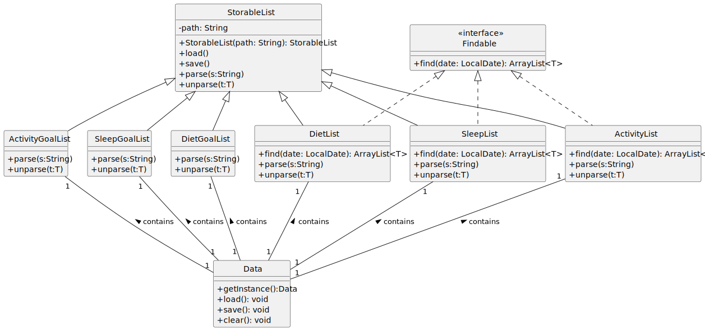
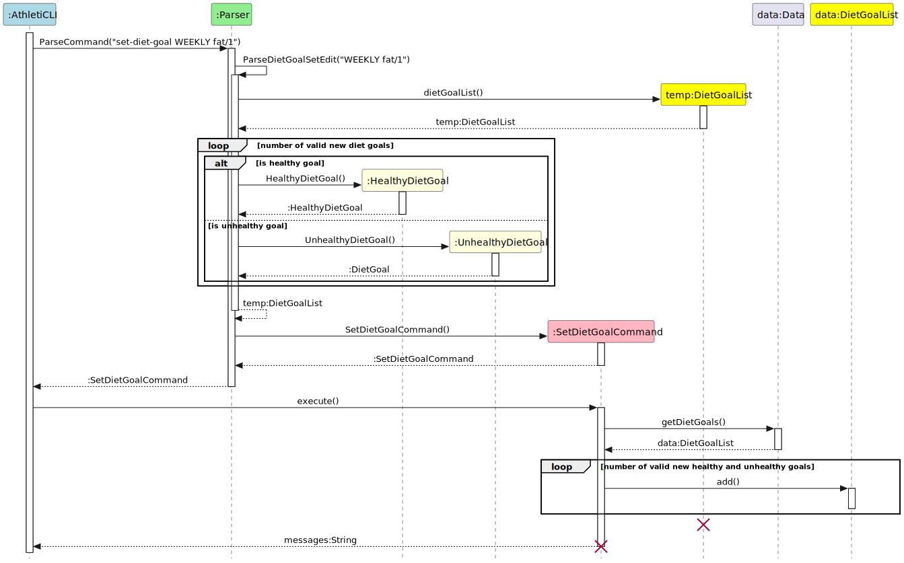
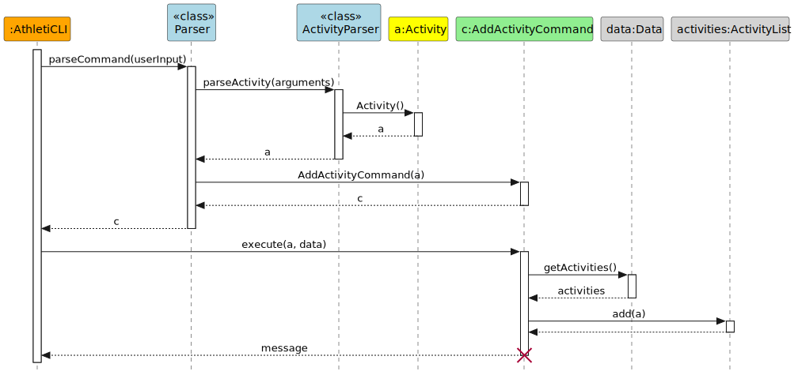
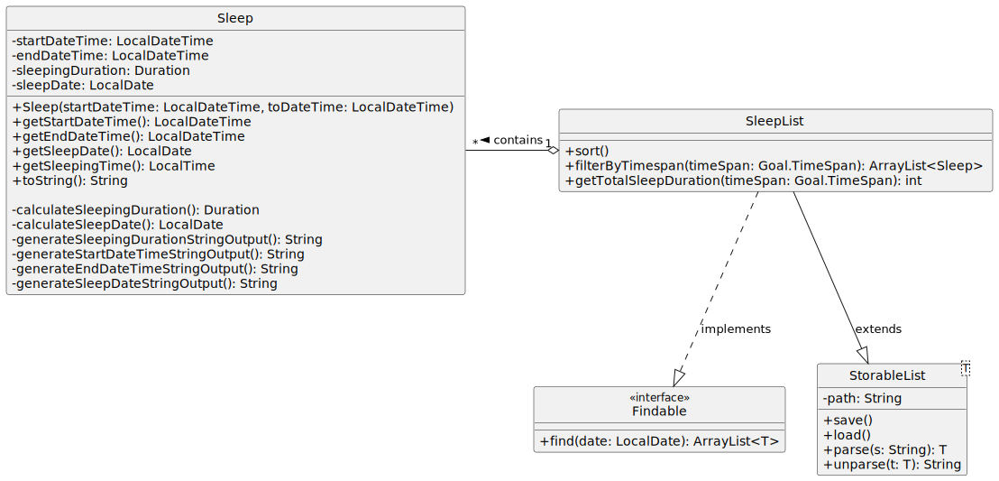

- Table of Contents
{:toc}
---
## Acknowledgements

[//]: # ({list here sources of all reused/adapted ideas, code, documentation, and third-party libraries -- include links to the original source as well})

1. [AB-3 Developer Guide](https://se-education.org/addressbook-level3/DeveloperGuide.html)
2. [PlantUML for sequence diagrams](https://plantuml.com/)

---
## Setting Up and Getting Started

First, fork [this repo](https://github.com/AY2324S1-CS2113-T17-1/tp), and clone the fork into your computer.

If you plan to use IntelliJ IDEA (highly recommended):

1. **Configure the JDK**: Follow the guide [se-edu/guides IDEA: Configuring the JDK](https://se-education.org/guides/tutorials/intellijJdk.html) to ensure IntelliJ is configured to use JDK 11.
2. **Import the project as a Gradle project**: Follow the guide
[se-edu/guides IDEA: Importing a Gradle project](https://se-education.org/guides/tutorials/intellijImportGradleProject.html)
to import the project into IDEA.

   :exclamation: **Note:** Importing a Gradle project is slightly different from importing a normal Java project.
3. **Verify the setup**:
   * Run `athlethicli.AthletiCLI` and try a few commands.
   * Run the tests using `./gradlew check` and ensure they all pass.

---
## Design

This section provides a high-level explanation of the design and implementation of AthletiCLI, 
supported by UML diagrams and short code snippets to illustrate the flow of data and interactions between the 
components.

---
### Architecture

Given below is a quick overview of main components and how they interact with each other.

**Main components of the architecture**

[`AthletiCLI`](https://github.com/AY2324S1-CS2113-T17-1/tp/blob/master/src/main/java/athleticli/AthletiCLI.java) is in charge of the app launch and shut down.

The bulk of the AthletiCLI’s work is done by the following components, with each of them corresponds to a package:

* [`Ui`](https://github.com/AY2324S1-CS2113-T17-1/tp/tree/master/src/main/java/athleticli/ui): Interacts with the user via the command line.
* [`Parser`](https://github.com/AY2324S1-CS2113-T17-1/tp/tree/master/src/main/java/athleticli/parser): Parses the commands input by the users.
* [`Storage`](https://github.com/AY2324S1-CS2113-T17-1/tp/tree/master/src/main/java/athleticli/storage): Reads data from, and writes data to, the hard disk.
* [`Data`](https://github.com/AY2324S1-CS2113-T17-1/tp/tree/master/src/main/java/athleticli/data): Holds the data of AthletiCLI in memory.
* [`Commands`](https://github.com/AY2324S1-CS2113-T17-1/tp/tree/master/src/main/java/athleticli/commands): Contains multiple command executors.

Other components:

* [`Exceptions`](https://github.com/AY2324S1-CS2113-T17-1/tp/tree/master/src/main/java/athleticli/exceptions): Represents exceptions used by multiple other components.
* [`Common`](https://github.com/AY2324S1-CS2113-T17-1/tp/tree/master/src/main/java/athleticli/common): Contains configurations that shared by other components.

### Overview

The class diagram shows the relationship between `AthletiCLI`, `Ui`, `Parser`, and `Data`.

### Data Component

The class diagram shows how the `Data` component is constructed with multiple classes.

### Parser Component

The class diagram shows how the `Parser` component is constructed with multiple classes.

**How the architecture components interact with each other**

The _Sequence Diagram_ below shows how the components interact with each other for the scenario where the user issues the command `help add-diet`.

This diagram involves the interaction between `AthletiCLI`, `Ui`, `Parser`, `Commands` components and the user.

The `Storage` component only interacts with the `Data` component. The _Sequence Diagram_ below shows how they interact with each other for the scenario where a `save` command is executed.

For simplicity, only 1 `StorableList` is drawn instead of the actual 6.

---

## Implementation

### Diet Management in AthletiCLI

#### [Implemented] Adding, Editing, Deleting, Listing, and Finding Diets

Regardless of the operation you are performing on diets (adding, editing, deleting, listing, or finding), the process
follows a general five-step pattern in AthletiCLI:

**Step 1 - Input Processing:** The user's input is passed through AthletiCLI to the `Parser` class. Examples of user
inputs include:

- `add-diet calories/500 protein/20 carb/50 fat/10 datetime/2021-09-01 06:00` for adding a diet.
- `edit-diet 1 calories/500 protein/20 carb/50 fat/10 datetime/2021-09-01 06:00` for editing a diet at index 1.
- `delete-diet 1` for deleting a diet at index 1.
- `list-diet` for listing all diets.
- `find-diet 2021-09-01` for finding all diets on 1st September 2021.

**Step 2 - Command Identification:** The `Parser` class identifies the type of diet operation and calls the
appropriate `DietParser` method to parse the necessary parameters (if any). For example, the `add-diet` command will
call the `DietParser#parseDiet()` method, which will return a `Diet` object.

**Step 3 - Command Creation**: An instance of the corresponding command class is created (e.g., `AddDietCommand`,
`EditDietCommand`, etc.) using the returned object (if any) from the `DietParser` and returned to AthletiCLI.

**Step 4 - Command Execution**: AthletiCLI executes the command, interacting with the data instance of DietList to
perform the required operation. For example, the `AddDietCommand` will add the `Diet` object to the `DietList` object,
while the `EditDietCommand` will edit the `Diet` object at the specified index in the `DietList` object.

**Step 5 - Result Display**: A message is returned post-execution and passed through AthletiCLI to the UI for
display to the user. This is useful for informing the user of the success or failure of the operation.

By following these general steps, AthletiCLI ensures a streamlined process for managing diet-related tasks.

Here is the sequence diagram for the `edit-diet` command to illustrate the five-step process:

> The diagram shows the interaction between the `AthletiCLI`, `Parser`, `Command`, and `Data` components.
> The use of HashMaps in the `DietParser` class allows for a more flexible and extensible design, as it facilitates
> the modification of necessary parameters without requiring the user to specify all parameters in the command. For 
> example, the user can choose to edit only the calories and protein of a diet, without specifying the carb and fat values.

#### [Implemented] Setting Up of Diet Goals

This following sequence diagram show how the 'set-diet-goal' command works:

**Step 1:** The input from the user ("set-diet-goal WEEKLY fat/1") runs through AthletiCLI to the Parser Class.

**Step 2:** The Parser Class will identify the request as setting up a diet goal and pass in the parameters
"WEEKLY fat/1".

**Step 3:** A temporary dietGoalList is created to store newly created diet goals. In this case, a weekly healthy goal 
for fat with a target value of 1mg.

**Step 4:** The inputs are validated against our lists of approved diet goals.

**Step 5:** For each of the diet goals that are valid, if it is a healthy goal, a HealthyDietGoal object will be created and stored in the 
temporary dietGoalList, else an UnhealthyDietGoal will be created instead.

**Step 6:** The Parser then creates for an instance of SetDietGoalCommand and returns the instance to 
AthletiCLI.

**Step 7:** AthletiCLI will execute the SetDietGoalCommand. This adds the dietGoals that are present in the 
temporary list into the data instance of DietGoalList which will be kept for records.

**Step 8:** After executing the SetDietGoalCommand, SetDietGoalCommand returns a message that is passed to 
AthletiCLI to be passed to UI(not shown) for display.

#### [Proposed] Future Implementation of DietGoalList Class

The current implementation of DietGoalList is an ArrayList. This is because the number of nutrients currently is 4. O(n^2)
operations can be treated as O(1). Furthermore, DietGoalListClass gets to inherits from superclass like its other goals' counterpart.
However, it is not efficient in searching for a particular dietGoal especially when the number of goals and time span for goals increases.
At any instance of time, there could only be the existence of one dietGoal.
Verifying if there is an existence of a diet goal using an ArrayList takes O(n) time, where n is the number of dietGoals.
The proposed change will be to change the underlying data structure to a hashmap in the future for amortised O(1) time complexity
for checking the presence of a dietGoal.

### Activity Management in AthletiCLI

#### [Implemented] Adding activities

The `add-activity` feature is a core functionality which allows users to record new activities in the application.
The feature is designed in a modular and extendable way, ensuring seamless integration of future enhancements and 
especially new activity types.

The architecture of the `add-activity` feature is composed of the following main components.
1. `AthletiCLI`: Facilitates the mechanism. It captures the user input and initiates the parsing and execution.
2. `Parser` (`Activity Parser`): Interprets the user input, generating both the appropriate command object and 
   the activity instance.
3. `AddActivityCommand`: Encapsulates the execution of the `add-activity` command, adding the activity to the data.
4. `ActivityChanges`: Contains the arguments of the activity to be added. It is used to transfer the data from the 
   parser to the activity in a modular way.
5. `Activity`: Represents the activity to be added. It is a superclass for specific activity types like Run, Swim and 
   Cycle.
6. `Data`: Manages the current state of the activity list.
7. `ActivityList`: Maintains the list of all activities added to the application.

Class Relationships:

Below is a class diagram illustrating the relationships between the data components `Activity`,`Data` and 
`ActivityList`:

> The diagram shows the inheritance relationship between the `Activity` class and the specific activity types `Run`, 
> `Swim` and `Cycle`, each with unique attributes and methods. This design becomes especially crucial in future 
> development cycles with added parameters and activity types. The `ActivityList` aggregates these instances.

Usage Scenario and Process Flow:

The process of adding an activity involves several steps, each handled by different components.
Given below is an example usage scenario on how the add mechanism behaves.

**Step 1 - Input Capture:** The user issues an `add-activity ...` (or `add-run`, etc.) command which is 
captured and forwarded to the Parser by the running AthletiCLI instance.

**Step 2 - Activity Parsing:** The ActivityParser interprets the raw input to obtain the arguments of the activity. 
Given that all parameters are provided correctly and no exception is thrown, a new activity object is created.

This diagram illustrates the activity parsing process in more detail:
The `ActivityChanges` object plays a key role in the parsing process. It is used for storing the 
different attributes of the activity that are to be added. Later, the `ActivityParser` 
will use the `ActivityChanges` to create the `Activity` object. 
> This way of transferring data between the parser and the activity is more flexible which is suitable for future
> extensions of the activity types and allows for a more modular design. This design and most of the methods can be reused
> for the `edit-activity` mechanism, which works in the same way with slight modifications due to optional parameters.

  

**Step 3 - Command Parsing:** Afterwards the parser constructs an `AddActivityCommand` embedding the newly created 
activity within it. The `AddActivityCommand` implements the `AddActivityCommand#execute()` operation and is passed to 
the AthletiCLI instance.

**Step 4 - Activity Addition:** The AthletiCLI instance executes the `AddActivityCommand` object. The command 
accesses the data and retrieves the currently stored list of activities stored inside it. The new `Activity` object is 
then added to the `ActivityList`.

**Step 5 - User Interaction:** Upon successful addition of the activity, a confirmation message is displayed to the 
user.

The following sequence diagram visually represents the flow and interactions of components during the `add-activity` 
operation:

#### [Implemented] Tracking activity goals

The `set-activity-goal` feature allows users to set and track periodic goals for their activities.
The goal fulfillment is automatically monitored and can be reviewed by the user at any time.

These are the key components and their roles in the architecture of the goal tracking:
* `SetActivityGoalCommand`: Encapsulates the execution of the `set-activity-goal` command. It adds 
  the activity goal to the data.
* `ActivityGoal`: Represents the activity goal that is to be added and contains functionality to 
  track the fulfillment of the goal. 
* `ActivityList`: Contains key functionality to retrieve and filter the activity list according to the specified 
  criteria of the goal.

Given below is an example usage scenario and how the goal setting and tracking mechanism behaves at 
each step.

**Step 1 - Input Capture:** The user issues a `set-activity-goal ...` command which is captured and passed to the 
   Parser by the running AthletiCLI instance.

**Step 2 - Goal Parsing:** The `ActivityParser` parses the raw input to obtain the sports, target and timespan of the 
   goal. 
   Given that all these parameters are provided correctly and no exception is thrown, a new activity goal object is 
   created.

**Step 3 - Command Parsing:** In addition the parser will create a `SetActivityGoalCommand` object with the newly 
   added activity goal attached to it. The command implements the `SetActivityGoalCommand#execute()` operation and is 
   passed to the AthletiCLI instance.

**Step 4 - Goal Addition:** The AthletiCLI instance executes the `SetActivityGoalCommand` object. The command will 
   access the data and retrieve the currently stored list of activity goals stored inside it. The new `ActivityGoal` 
   object is added to the list.

The following sequence diagram shows how the `set-activity-goal` operation works:

Assume that the user has set a goal to run 10km per week and has already tracked two running activities of 5km each 
within the last 7 days as well as three older sport activities. The object diagram below shows the state of the 
scenario with the eligible activities for the goal highlighted in green.

The following describes how the goal evaluation works after being invoked by the user, e.g., with a `list-activity-goal` command:

**Step 5 - Goal Assessment:** The evaluation of the goal is operated by the `ActivityGoal` object. It retrieves the 
activity list with the five tracked activities from the data and calls the total distance calculation function. It 
   filters the activity list according to the specified timespan and sports of the goal. The current value obtained by this, 
   10km in the example, is returned to the `ActivityGoal` object. This output is compared to the target value of the 
   goal. This mechanism is visualized in the following sequence diagram:

The `edit-activity-goal` and `delete-activity-goal` operations function similarly. They use the arguments `sport`,
`type`, and `period` to identify the specific goal to be edited or deleted. If there is no existing goal that
matches the specified criteria, an error message is displayed to the user.

Similar to `set-activity-goal`, the operations `edit-activity-goal` and `delete-activity-goal` utilize
`ActivityGoal` objects to represent the goals being edited or deleted. During the execution of these commands, the
system quickly verifies whether the goal exists in the `ActivityGoalList`. If the goal is found, it is then edited
or deleted as requested.

Finally, the `list-activity-goal` operation is designed similarly to the `list-activity` operation. It involves
retrieving the `ActivityGoalList` from the database and displaying the goals to the user.

### Sleep Management in AthletiCLI

#### [Implemented] Finding, Adding, Editing, Deleting, Listing Sleep

1. **Input Processing**: The user's input is passed through AthletiCLI to the Parser Class. Examples of user inputs include:
    - "add-sleep hours/8 datetime/2021-09-01 06:00" for adding sleep.
    - "edit-sleep 1 hours/8 datetime/2021-09-01 06:00" for editing sleep.
    - "delete-sleep 1" for deleting sleep.
    - "list-sleep" for listing all sleep.

2. **Command Identification**: The Parser Class identifies the type of sleep operation and passes the necessary parameters.

3. **Command Creation**: An instance of the corresponding command class is created (e.g., AddSleepCommand, EditSleepCommand, etc.) and returned to AthletiCLI.

4. **Command Execution**: AthletiCLI executes the command, interacting with the data instance of SleepList to perform the required operation.

5. **Result Display**: A message is returned post-execution and passed through AthletiCLI to the UI for display to the user.

In particular to demonstrate all parser classes, the following sequence diagram shows how the `edit-sleep` command works:

The sleep parser was originally designed with little modularity, with each sleep instruction having to be parsed individually. This resulted in a lot of code duplication and was not very modular. This also resulted in having to reimplement much of the input checking logic for each sleep instruction, and many different error messages that was difficult to maintain. 

Therefore a refactoring was done such that we only have a sleep object parser, sleep index parser and sleep goal parser that interacts with the sleep parser. This allows us to reuse the input checking logic and error messages. This also allows us to have a more modular design and reduce code duplication.

#### [Implemented] Sleep Structure

The following class diagram demonstrates the relationship between the data components Sleep, SleepList, as well as the Findable interface and the StorableList abstract class.

The design decision for why we have decided to implement a findable interface and a storable list abstract class is to have a more modular design. Therefore allowing for easier extension of the code in the future when implementing other data classes as well, such as extending to hydration and other possible data classes.

#### [Implemented] Sleep Duration and Date calculation

Initially sleep entries do not have an associated date, this makes it much more difficult to find the sleep entries for a specific date. Therefore we have decided to add a date field to the sleep entries. 

However, there are complications surrounding calculation of sleep date. Many people often sleep past midnight, and this results in the sleep date being the next day instead of the current day. Therefore we have decided that for sleeps starting before 06:00 on the next day, the sleep date will be the previous day. This allows us to have a more accurate representation of the sleep date.

**[Challenge]**

Initially, the design of the sleep duration used integer to store the seconds of the sleep duration. However, this design results in much difficulty when it comes to the calculation of the sleep duration. 

For instance, when printing the sleep duration string, we have to convert the seconds into hours, minutes and seconds. This results in a lot of code duplication and is not very modular.

**[Solution]**

Therefore we have decided to change the design of the sleep duration to use the Duration class from the Java library. This allows us to use the built-in functions to calculate the sleep duration and convert the sleep duration into a string. This results in a more modular design and reduces code duplication.

#### [Implemented] Sleep Goals

The sleep goals feature allows users to set and track periodic goals for their sleep duration.

The implementation of sleep goals is similar to the implementation of activity goals. Therefore the implementation of sleep goals is not described in detail here.

**[Future Implementation]**
For Sleep Goals originally there were plans to incorporate a sleep quality goal where an optimum sleep start time and end time would be set. However, due to issues surrounding modular design, and how we will have to extend our common Goal interface and abstract classes to include more methods, we have decided to not implement this feature. It will be implemented in a future version of AthletiCLI.

---

## Product scope

### Target user profile

AthletiCLI is designed for athletic individuals who are committed to optimizing their performance. 

These users are highly disciplined and engaged not only in regular, intense physical training but also in nutrition, mental conditioning, and recovery. 

They are looking for a holistic tool that integrates all facets of an athletic lifestyle. AthletiCLI serves as a daily or weekly companion, designed to monitor, track, and analyze various elements crucial for high-level athletic performance. 

### Value proposition

AthletiCLI provides a streamlined, integrated solution for athletic individuals focused on achieving peak performance. 

While the app includes robust capabilities for tracking physical training metrics, it also offers features for monitoring dietary habits and sleep metrics. 

By providing a comprehensive view of various performance-related factors over time, AthletiCLI enables athletes to identify trends, refine their training and lifestyle habits, and optimize outcomes. The app is more than a tracking tool—it's a performance optimization platform that takes into account the full spectrum of an athlete's life. 

---

## User Stories

| Version | As a ...                        | I want to ...                                                     | So that I can ...                                                                      |
|---------|---------------------------------|-------------------------------------------------------------------|----------------------------------------------------------------------------------------|
| v1.0    | fitness enthusiastic user       | add different activities including running, swimming and cycling) | keep track of my fitness activities and athletic performance.                          |
| v1.0    | analytical user                 | view my activity details at any point in time                     | track my progress and make informed decisions about my fitness routine.                |
| v1.0    | clumsy user                     | delete any tracked activity                                       | I can correct any mistakes or remove accidentally added activities.                    |
| v1.0    | detail-oriented user            | modify any of my tracked activities                               | ensure accuracy in my fitness records.                                                 |
| v1.0    | health-conscious user           | add my dietary information                                        | keep track of my daily calorie and nutrient intake                                     |
| v1.0    | organized user                  | delete a dietary entry                                            | remove outdated or incorrect data from my diet records                                 |
| v1.0    | fitness enthusiast              | view all my diet records                                          | have a clear overview of my dietary habits and make informed decisions on my diet      |
| v1.0    | new user                        | see usage instructions                                            | refer to them when I forget how to use the application                                 |
| v1.0    | motivated weight-conscious user | set diet goals                                                    | have the motivation to work towards keeping weight in check.                           |
| v1.0    | forgetful user                  | see all my diet goals                                             | remind myself of all the diet goals I have set.                                        |
| v1.0    | regretful user                  | remove my diet goals                                              | I can rescind the strict goals I set previously when I find the goals too far fetched. |
| v1.0    | motivated user                  | update my diet goals                                              | I can work towards better version of myself by setting stricter goals.                 |
| v1.0    | sleep deprived user             | add my sleep information                                          | keep track of my sleep habits and identify areas for improvement                       |
| v1.0    | sleep deprived user             | delete a sleep entry                                              | remove outdated or incorrect data from my sleep records                                |
| v1.0    | sleep deprived user             | view all my sleep records                                         | have a clear overview of my sleep habits and make informed decisions on my sleep       |
| v1.0    | sleep deprived user             | edit my sleep entries                                             | correct any mistakes or update my sleep information as needed                          |
| v2.0    | user                            | find a to-do item by name                                         | locate a to-do without having to go through the entire list                            |
| v2.0    | meticulous user                 | edit my dietary entries                                           | correct any mistakes or update my diet information as needed                           |
| v2.0    | active user                     | set activity goals                                                | work towards a specific fitness target for different sports activities.                |
| v2.0    | adaptable athlete               | edit my activity goals                                            | modify my fitness targets to align with my current fitness level and schedule.         |
| v2.0    | organized athlete               | list all my activity goals                                        | have a clear overview of my set targets and track my progress easily.                  |
| v2.0    | meticulous user                 | find my diets by date                                             | easily retrieve my dietary records for a specific day and monitor my eating habits.    |
| v2.0    | motivated user                  | keep track of my diet goals for a period of time                  | I can monitor my diet progress on a weekly basis and increase or reduce if needed.     |                                         |
| v2.0    | goal-oriented user              | delete a specific activity goal                                   | remove goals that are no longer relevant or achievable for me.                         |                                         |
| v2.0    | sleep deprived user             | calculate sleep duration                                         | keep track of my sleep habits and identify areas for improvement                       |
| v2.0    | sleep deprived user             | find how much I slept on a specific date                          | easily retrieve my sleep records for a specific day and monitor my sleep habits.       |
| v2.1     | user with bad sleep habits      | set sleep goals                                                   | work towards a specific sleep target.                                                  |
| v2.1     | user with bad sleep habits      | edit my sleep goals                                               | modify my sleep targets to align with my current sleep habits.                         |
| v2.1     | user with bad sleep habits      | list all my sleep goals                                           | have a clear overview of my set targets and track my progress easily.                  |

---

## Non-Functional Requirements

1. AthletiCLI should work on Windows, macOS and Linux that has Java 11 installed.
2. AthletiCLI should be able to store data locally.
3. AthletiCLI should be able to work offline.
4. AthletiCLI should be easy to use.

---

## Glossary

[//]: # (* *glossary item* - Definition)
* **UI** - A short form for User Interface. A UI class refers to the class that is responsible for handling user input 
and provide feedback to the users.

---

## Instructions for manual testing

**Note**: This section serves to provide a quick start for manual testing on AthletiCLI. This list is not exhaustive.
Developers are expected to conduct more extensive tests.

### Initial Launch

* ✅ Download the latest AthletiCLI from the official repository.
* ✅ Copy the downloaded file to a folder you want to designate as the home for AthletiCLI.
* ✅ Open a command terminal, cd into the folder where you copied the file, and run `java -jar AthletiCLI.jar`.

### Activity Management

#### Activity Records

1. Adding different activities:
    - Test case 1:
        * Add a general activity.
        * Command: `add-activity Morning Run duration/01:00:00 distance/10000 datetime/2021-09-01 06:00`
        * Expected Outcome: A general activity with duration of 1 hour, distance of 10km, and datetime of 2021-09-01 is 
          added successfully and a short summary of the activity is displayed to the user.
    - Test case 2:
        * Add a run.
        * Command: `add-run Berlin Marathon duration/03:33:17 distance/42125 datetime/2023-08-10 07:00 elevation/10`
        * Expected Outcome: A run with duration of 3 hours 33 minutes 17 seconds, distance of 42.125km, datetime of 
          2023-08-10, and elevation of 10m is added successfully and a short summary of the activity is displayed to 
          the user.
    - Test case 3:
        * Try to add a swim without specifying swimming style.
        * Command: `add-swim Evening Swim duration/00:30:00 distance/1000 datetime/2021-09-01 06:00`
        * Expected Outcome: Error message indicating the swimming style is not specified is displayed.
2. Deleting an activity:
    - Test case 1:
        * Delete the first activity in a non-empty activity list.
        * Command: `delete-activity 1`
        * Expected Outcome: The first activity is deleted successfully. The activity is displayed to the user and 
          the activity list is updated.
    - Test case 2:
        * Delete an activity at an invalid index.
        * Command: `delete-activity 0`
        * Expected Outcome: Error message indicating the index is invalid is displayed.
3. List all activities:
    - Test case 1:
        * List all activities in a non-empty activity list.
        * Command: `list-activity`
        * Expected Outcome: All activities in the activity list are displayed to the user sorted by datetime.
    - Test case 2:
        * List all activities in a non-empty activity list with the detailed flag.
        * Command: `list-activity -d`
        * Expected Outcome: All activities in the activity list are displayed to the user with detailed information 
          like elevation for runs and cycles.
    - Test case 2:
        * List all activities in an empty activity list.
        * Command: `list-activity`
        * Expected Outcome: Message indicating the activity list is empty is displayed.
4. Find activities of a specific date:
   - Test case 1:
        * Find activities of a specific date with multiple entries on that date.
        * Command: `find-activity 2021-09-01`
        * Expected Outcome: All activities on 1st September 2021 are displayed to the user.
   - Test case 2:
        * Find activities of a specific date with no entries on that date.
        * Command: `find-activity 2021-09-02`
        * Expected Outcome: No activities are displayed
5. Edit an activity:
   - Test case 1:
        * Edit the caption of the first activity in the activity list, which is of type run.
        * Command: `edit-run 1 caption/Sunday=Runday`
        * Expected Outcome: The caption of the first activity is updated to "Sunday=Runday".
   - Test case 2:
        * Try to use the edit-swim command to edit a run.
        * Command: `edit-swim 1 caption/Sunday=Runday`
        * Expected Outcome: Error message indicating the activity type is not a swim is displayed.

#### Activity Goals

1. Setting Activity Goals
    - Test case 1:
        * Set a weekly running distance goal.
        * Command: `set-activity-goal sport/running type/distance period/weekly target/15000`
        * Expected Outcome: Weekly running goal of 15km is set successfully.
    - Test case 2:
        * Set a monthly swimming duration goal.
        * Command: `set-activity-goal sport/swimming type/duration period/monthly target/300`
        * Expected Outcome: Monthly swimming duration goal of 300 minutes is set successfully.

2. Editing Activity Goals
    - Test case 1:
        * Edit an existing weekly cycling distance goal.
        * Command: `edit-activity-goal sport/cycling type/distance period/weekly target/20000`
        * Expected Outcome: Weekly cycling distance goal is updated to 20km.
    - Test case 2:
        * Edit a non-existent yearly running duration goal.
        * Command: `edit-activity-goal sport/running type/duration period/yearly target/1000`
        * Expected Outcome: Error indicating no existing yearly running duration goal.

3. Listing Activity Goals
    - Test case 1:
        * List all set activity goals.
        * Command: `list-activity-goal`
        * Expected Outcome: All set activity goals along with their details are listed.

4. Deleting Activity Goals
    - Test case 1:
        * Delete an existing monthly swimming duration goal.
        * Command: `delete-activity-goal sport/swimming type/duration period/monthly`
        * Expected Outcome: Monthly swimming duration goal is deleted successfully.
    - Test case 2:
        * Attempt to delete a non-existent daily general activity goal.
        * Command: `delete-activity-goal sport/general type/distance period/daily`
        * Expected Outcome: Error indicating no such daily general activity goal exists.

### Diet Management

#### Diet Records

1. Adding Diets
    - Test case 1:
        * Add a complete diet entry.
        * Command: `add-diet calories/700 protein/25 carb/55 fat/15 datetime/2023-10-12 07:30`
        * Expected Outcome: Diet entry is successfully added with 700 calories, 25mg protein, 55mg carb, and 15mg fat.
    - Test case 2:
        * Attempt to add a diet entry with a future datetime.
        * Command: `add-diet calories/800 protein/30 carb/60 fat/20 datetime/3024-01-01 08:00`
        * Expected Outcome: Error indicating the datetime cannot be in the future.

2. Editing Diets
    - Test case 1:
        * Edit a specific diet entry.
        * Command: `edit-diet 2 calories/900 protein/40 carb/70 fat/25 datetime/2023-10-13 09:00`
        * Expected Outcome: The 2nd diet entry is updated with the new values.
    - Test case 2:
        * Edit a diet entry with only one parameter.
        * Command: `edit-diet 3 fat/30`
        * Expected Outcome: Only the fat value of the 3rd diet entry is updated.

3. Deleting Diets
    - Test case 1:
        * Delete a specific diet entry.
        * Command: `delete-diet 2`
        * Expected Outcome: The 2nd diet entry is successfully deleted.
    - Test case 2:
        * Attempt to delete a non-existent diet entry.
        * Command: `delete-diet 5`
        * Expected Outcome: Error indicating the diet entry does not exist.

4. Listing Diets
    - Test case 1:
        * List all diet entries.
        * Command: `list-diet`
        * Expected Outcome: All existing diet entries are displayed.

5. Finding Diets
    - Test case 1:
        * Find diets recorded on a specific date.
        * Command: `find-diet 2023-10-12`
        * Expected Outcome: Diets recorded on 12th October 2023 are displayed.
    - Test case 2:
        * Find diets on a date with no entries.
        * Command: `find-diet 2023-11-01`
        * Expected Outcome: No diets are displayed.

#### Diet Goals

1. Setting diet goals
   * Prerequisite: There are no similar goals present
   * Test case 1:
     * There are no diet goals constructed.
     * `set-diet-goal DAILY calories/500` creates a daily healthy calories goal with a target value of 500
   * Test case 2:
     * There are no diet goals constructed.
     * `set-diet-goal WEEKLY calories/500 fat/600` Creates 2 weekly healthy nutrient goals: calories and fat.
   * Test case 3:
     * There is a daily healthy calories goal present.
     * `set-diet-goal DAILY calories/500` will result in an error since the goal is already present.
   * Test case 4:
     * There is a daily healthy calories goal present.
     * `set-diet-goal DAILY unhealthy calories/500` will result in an error as a nutrient goal cannot be healthy 
     and unhealthy at the same time.
   * Test case 5:
     * There is a daily healthy calories goal present with a target value of 1000
     * `set-diet-goal WEEKLY healthy calories/500` will result in an error since the value of the daily diet goal 
     is greater than the value of weekly diet goal.
2. Listing diet goals
   * Test case 1:
     * `list-diet-goal` lists all the diet goals that are created and present in the diet goal records.
3. Deleting diet goals
   * Test case 1:
     * There is one diet goal present in the diet goal records.
     * `delete-diet-goal 1` removes the goal from the diet goal records.
   * Test case 2:
     * `delete-diet-goal` without any index to delete the goal or non-positive integers provided 
     or the value is greater than the number of diet goals present in the diet goal records, error will be thrown.
4. Editing diet goals
   * This is similar to setting diet goal, but the goal is required to be in the diet goals record first.
   * Users are only allowed to edit the target value of the goal. There is no edit supported to edit diet goal 
   types or diet goal time span.
   * Test case 1:
     * No goals present in the records.
     * `edit-diet-goal WEEKLY calories/5000` will return an error since there are no associated goals to 
     make an edit to the goal's target value.
   * Test case 2: 
     * Weekly healthy calories goal is present with a target value of 20.
     * `edit-diet-goal WEEKLY calories/5000` will update the target value of weekly healthy calories goal to 5000.
   * Similar to setting diet goals, the weekly goal values should always be greater than the daily goal values.

### Sleep Management

#### Sleep Records
1. Adding Sleep
    - Test case 1:
        * Add a sleep record.
        * Command: `add-sleep start/2021-09-01 06:00 end/2021-09-01 07:00`
        * Expected Outcome: Sleep record is successfully added with start time of 2021-09-01 06:00 and end time of 
        2021-09-01 07:00.
    - Test case 2:
        * Attempt to add a sleep record with a future start time.
        * Command: `add-sleep start/3024-01-01 08:00 end/3024-01-01 09:00`
        * Expected Outcome: Error indicating the start time cannot be in the future.
    - Test case 3:
        * Attempt to add a sleep record with a start time later than the end time.
        * Command: `add-sleep start/2021-09-01 08:00 end/2021-09-01 07:00`
        * Expected Outcome: Error indicating the start time cannot be later than the end time.

2. Editing Sleep
    - Test case 1:
        * Edit a specific sleep record.
        * Command: `edit-sleep 2 start/2021-09-01 09:00 end/2021-09-01 10:00`
        * Expected Outcome: The 2nd sleep record is updated with the new values.
    - Test case 2:
        * Edit a sleep record with only one parameter.
        * Command: `edit-sleep 3 end/2021-09-01 11:00`
        * Expected Outcome: Error indicating the start time is not specified.
    - Test case 3:
        * Edit a sleep record with a invalid index.
        * Command: `edit-sleep -1011 start/2021-09-01 09:00 end/2021-09-01 10:00`
        * Expected Outcome: Error indicating the index is invalid.

3. Deleting Sleep
   
    **Assuming there are 4 sleep records in the sleep list**
    - Test case 1:
        * Delete a specific sleep record.
        * Command: `delete-sleep 2`
        * Expected Outcome: The 2nd sleep record is successfully deleted.
    - Test case 2:
        * Attempt to delete a non-existent sleep record.
        * Command: `delete-sleep 5`
        * Expected Outcome: Error indicating the sleep record does not exist.
4. Listing Sleep
    - Test case 1:
        * List all sleep records.
        * Command: `list-sleep`
        * Expected Outcome: All existing sleep records are displayed.

#### Sleep Goals
1. Setting sleep goals

    - Test case 1:
        * Set a daily sleep duration goal.
        * Command: `set-sleep-goal type/duration period/daily target/90`
        * Expected Outcome: Daily sleep duration goal of 90 minutes is set successfully.
    - Test case 2:
        * Set a weekly sleep duration goal.
        * Command: `set-sleep-goal type/duration period/weekly target/600`
        * Expected Outcome: Weekly sleep duration goal of 600 minutes is set successfully.
    - Test case 3:
        * Attempt to set a duplicate daily sleep duration goal.
        
        **Assuming there is a daily sleep duration goal**

        * Command: `set-sleep-goal type/duration period/daily target/90`
        * Expected Outcome: Error indicating the daily sleep duration goal already exists.

2. Editing sleep goals
    - Test case 1:
        * Edit an existing daily sleep duration goal.
        * Command: `edit-sleep-goal type/duration period/daily target/120`
        * Expected Outcome: Daily sleep duration goal is updated to 120 minutes.
    - Test case 2:
        * Edit a non-existent weekly sleep duration goal.
        * Command: `edit-sleep-goal type/duration period/weekly target/1000`
        * Expected Outcome: Error indicating no existing weekly sleep duration goal.

3. Listing sleep goals
    - Test case 1:
        * List all set sleep goals.
        * Command: `list-sleep-goal`
        * Expected Outcome: All set sleep goals along with their details are listed.

### Miscellaneous

1. Finding Records
   * Test case:
       * Command: `find-diet 2023-12-31`
       * Expected Outcome: All records on 31st December 2023 are displayed.

1. Saving Files
   * Test case:
       * Command: `save`
       * Expected Outcome: Data are safely saved into the files.

1. Exiting AthletiCLI:
   * Test case 1:
     * Immediately after detecting a format error in the saved files.
     * Command: `bye`
     * Expected Outcome: AthletiCLI is exited without rewriting the files.
   * Test case 2:
     * During normal execution.
     * Command: `bye` 
     * Expected Outcome: AthletiCLI is exited and the files are safely saved.

1. Viewing Help Messages:
   * Test case 1:
     * Command: `help`
     * Expected Outcome: A list containing the syntax of all commands is shown.
   * Test case 2:
     * Command: `help add-diet`
     * Expected Outcome: The syntax of the `add-diet` command is shown.
